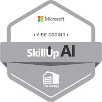
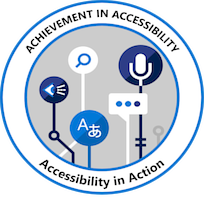

# AI Architecture Portfolio

Welcome to my **AI Architecture Portfolio**, showcasing solution designs, governance frameworks, and business-to-technical mappings for **AI-driven enterprise and telco use cases**.

This portfolio demonstrates **architecture thinking**, **Responsible AI principles**, and **integration strategies** — not coding.

> *All architectures and case studies presented here are original work created for demonstration purposes. They reflect general industry patterns and publicly available cloud services — not proprietary implementations.*

---

## About Me

- **Role:** AI Solution Architect
- **Background:** 20+ years in telco mobile packet core, carrier-grade infrastructure, and enterprise architecture
- **Focus:** Agentic AI design, declarative agent architectures, and AI-assisted development workflows
- **Mindset:** Every solution is designed with mission-critical principles — because AI systems serving telecom operators inherit the same availability and resilience expectations as the networks they support.

---

## Architecture Principles

These principles come from two decades of building and operating carrier-grade telco systems, now applied to AI solution design:

| Principle | What It Means In Practice |
|-----------|--------------------------|
| **Five-nines thinking** | Design for 99.999% availability — graceful degradation, no single points of failure |
| **Zero Trust security** | Managed identity, no API keys, least-privilege access, encrypt everything in transit and at rest |
| **Disaster recovery by design** | Multi-region readiness, data replication, recovery objectives defined upfront — not bolted on later |
| **Modular & composable** | Independent components that can be replaced, scaled, or retired without cascading impact |
| **Operationally simple** | If it's hard to operate, it's badly designed. Observability, structured logging, and clear runbooks from day one |
| **Built to be maintained** | Architecture decisions documented (ADRs), infrastructure as code, automated drift detection |
| **Resilient by default** | Retry policies, circuit breakers, graceful fallbacks — assume failure will happen |
| **Compliance-native** | Responsible AI, accessibility, privacy, and license compliance integrated from the start — not an afterthought |

---

## [Governance & Compliance →](governance-compliance/)
AI governance reviews (Responsible AI, threat modeling, accessibility, privacy, open-source license compliance) and automated architecture drift detection.

---

## Reference Architectures

*Drawing on experience in enterprise telco environments and based on Azure reference architectures and industry best practices.*

### 1. Declarative AI Agent: Software Release Impact Advisor
- **Scenario:** Telco operators upgrading network platform software need to understand new features, bug fixes, deprecations, and known issues across every intermediate release. This agent automates hours of manual document review and produces structured, citation-backed impact assessment reports.
- **Architecture Pattern:** Declarative agent (no runtime code) using RAG with hybrid retrieval (semantic + keyword search) and semantic re-ranking over vendor release documentation.
- **Key Design Decisions:**

  | Decision | Rationale |
  |----------|-----------|
  | No runtime code | Pure prompt engineering — the AI platform handles execution |
  | Strict domain scoping | Agent refuses out-of-scope queries to prevent misuse |
  | Mandatory output template | Consistent 5-section Markdown report for every response |
  | Version-aware retrieval | Semantic versioning used as a filter for precise document retrieval |
  | No-invention policy | Unknown values labeled explicitly — no hallucinated data |

- **Value Proposition:** Reduces upgrade impact analysis from hours of manual review to minutes, with full citation traceability.

### 2. Privacy-First Network Configuration Analyzer
- **Scenario:** Telecom operators need to analyze network platform configuration files to detect active licensed features, identify missing configurations, and safely anonymize sensitive data before sharing configs with support teams or vendors.
- **Architecture Pattern:** Zero-dependency, fully offline static web application — pure client-side processing with no cloud backend, no telemetry, and no data leaving the browser. Designed for air-gapped environments.
- **Key Capabilities:**

  | Capability | Approach |
  |------------|----------|
  | SKU/License detection | Regex-driven pattern matching across 19 licensed feature signatures |
  | Configuration anonymization | Masks all PII (IPs, hostnames, MACs, phone numbers) for safe sharing |
  | Feature analysis | Parses 18 config sections with visual indicators for configured vs. missing |

- **Key Design Decisions:**

  | Decision | Rationale |
  |----------|-----------|
  | Privacy-first | Zero network calls, no telemetry — everything runs in-browser |
  | No framework / no dependencies | Single-class vanilla JS — no CDNs, no npm, fully offline-capable |
  | Air-gapped distribution | Runs via file:// protocol or local HTTP server |
  | Progressive disclosure | URL parameter flags unlock advanced UI; default is MVP mode |
  | Regex-driven analysis | Deterministic, auditable pattern matching — no ML black box needed |

- **Value Proposition:** Enables secure configuration sharing and feature auditing without exposing sensitive network data, deployable in restricted environments with zero infrastructure.

### 3. Embeddable RAG Chatbot for Telco Support Engineering
- **Scenario:** Support engineers managing 3GPP network nodes (PGW, SGW, UPF, etc.) need instant, contextual answers grounded in actual technical documentation — CLI references, XML configurations, and troubleshooting guides. This production-ready chat widget embeds into internal portals, reducing support ticket volume through AI-powered self-service.
- **Architecture Pattern:** Full-stack RAG application with hybrid retrieval (vector + keyword), streaming chat, multi-tenant conversation history, and enterprise-grade security (zero API keys, managed identity throughout).
- **Azure Services:**

  | Service | Role |
  |---------|------|
  | Azure OpenAI (GPT-4o) | LLM for streaming chat responses |
  | Azure OpenAI (ada-002) | Embeddings for vector search |
  | Azure AI Search | Hybrid vector + keyword RAG retrieval |
  | Azure Cosmos DB (HPK) | Multi-tenant conversation history with partition isolation |
  | Azure Container Apps | FastAPI async backend hosting |
  | Azure Static Web Apps | Frontend CDN + API proxy |
  | Azure AI Foundry Hub | Model governance & experiment tracking |
  | Azure Key Vault | Secrets management |
  | Microsoft Entra ID | JWT authentication, managed identity |
  | App Insights + Log Analytics | Observability with PII-safe logging |

- **Key Design Decisions:**

  | Decision | Rationale |
  |----------|-----------|
  | Managed Identity everywhere | DefaultAzureCredential, zero API keys in all environments |
  | AI Foundry Hub governance | Centralized model access with tiered TPM quotas |
  | Cosmos DB with hierarchical partition keys | Multi-tenant user isolation beyond 20GB partition limits |
  | Phased RAG expansion | Iterative ingestion — CLI examples → XML configs → tech-support docs |
  | Embeddable widget | React 18 + Fluent UI v9, iframe-embeddable with Zustand state management |
  | Env-parameterized Bicep IaC | Dev/test/prod via parameter files, single deploy script |
  | CORS at infrastructure level | Handled in Container Apps Bicep, not application middleware |
  | Two-repo architecture | Separation of architecture decisions (ADRs, governance) from implementation |

- **Value Proposition:** Transforms support engineering from manual documentation lookup to instant, citation-backed AI answers — with enterprise security, multi-tenancy, and full observability built in.

- **Architecture Diagram:**

graph TB
    subgraph "Frontend"
        SWA["Azure Static Web Apps (React 18 + Fluent UI v9)"]
    end

    subgraph "Backend"
        ACA["Azure Container Apps (FastAPI async)"]
    end

    subgraph "AI Services"
        AOAI_GPT["Azure OpenAI GPT-4o"]
        AOAI_EMB["Azure OpenAI ada-002 Embeddings"]
        AIS["Azure AI Search (Hybrid: Vector + Keyword)"]
        FOUNDRY["Azure AI Foundry Hub (Model Governance)"]
    end

    subgraph "Data & Storage"
        COSMOS["Azure Cosmos DB (HPK) (Multi-tenant History)"]
        DOCS["Technical Documentation (CLI, XML, Support Docs)"]
    end

    subgraph "Security & Observability"
        ENTRA["Microsoft Entra ID (JWT + Managed Identity)"]
        KV["Azure Key Vault"]
        APPINS["App Insights + Log Analytics"]
    end

    SWA -->|"API proxy"| ACA
    ACA -->|"Streaming chat"| AOAI_GPT
    ACA -->|"Embed query"| AOAI_EMB
    AOAI_EMB -->|"Vector search"| AIS
    ACA -->|"Hybrid retrieval"| AIS
    DOCS -->|"Indexed"| AIS
    ACA -->|"Read/write history"| COSMOS
    FOUNDRY -.->|"TPM quotas"| AOAI_GPT
    ENTRA -.->|"Auth"| ACA
    ENTRA -.->|"Managed Identity"| AOAI_GPT
    ENTRA -.->|"Managed Identity"| COSMOS
    KV -.->|"Secrets"| ACA
    ACA -.->|"Telemetry"| APPINS

### 4. Multi-Agent Support Ticket Triage & Resolution System
- **Scenario:** A telecom support team handling thousands of tickets needs to triage faster, classify severity accurately, surface relevant knowledge, and reduce repetitive diagnostic work — all without removing the engineer from the decision loop.
- **Architecture Pattern:** Multi-agent system with independently invocable AI agents (classification, knowledge search, troubleshooting, summarization) embedded as a sidebar widget in the existing ticketing platform. Human-in-the-loop: engineers approve all AI-suggested actions before write-back.
- **AI Services & Patterns:**

  | Service / Pattern | Role |
  |-------------------|------|
  | Multi-agent architecture | Independent agents for classification, search, troubleshooting, summary |
  | RAG | Troubleshooting step generation grounded in knowledge base |
  | Embedding models (Sentence Transformers) | Semantic search for knowledge articles |
  | ML ranking (LambdaMART / XGBoost) | Relevance scoring for search results |
  | Similarity algorithms (Cosine, Jaccard, Levenshtein) | Similar case matching across 90-day history |
  | BM25 scoring | Text relevance for knowledge base search |
  | Serverless event handlers | Webhooks for ticket create, update, and conversation events |
  | API gateway / orchestrator | Event routing, audit logging, security |

- **Key Design Decisions:**

  | Decision | Rationale |
  |----------|-----------|
  | Human-in-the-loop (HITL) | Engineer must approve before any AI write-back to tickets |
  | Independent agents | Each capability runs standalone — not a monolithic pipeline |
  | Embedded in existing workflow | Sidebar widget in the ticketing platform, not a separate app |
  | Architecture-only repo | Design docs, ADRs, workflow diagrams — no app code |
  | MVP scope discipline | Features re-baselined mid-project to maintain delivery focus |
  | Re-evaluation triggers | AI re-runs on ticket updates, not just on creation |
  | Responsible AI guardrails | Dedicated feature for privacy, security, and RAI compliance |

- **Data Pipeline Architecture:**

  The system spans a multi-stage data pipeline across three resource groups:

  **Stage 1 — Data Ingestion:**
  Third-party ticketing system → Logic App connectors → Cosmos DB (18+ collections: tickets, agents, companies, contacts, conversations, knowledge articles, forums, manuals)

  **Stage 2 — ETL & Analytics (Microsoft Fabric):**
  Cosmos DB mirror → Fabric notebooks transform raw data into curated lakehouses (tickets, knowledge articles, forums) → Semantic model feeds Power BI reports → Reverse sync pushes curated data to a second Cosmos DB

  **Stage 3 — AI Search Layer:**
  Curated Cosmos DB → 5 data sources → 5 indexers → Azure AI Search indexes (manuals index, unified index) serving both this system and the RAG chatbot (#3)

- **Infrastructure Decisions:**

  | Decision | Rationale |
  |----------|-----------|
  | Microsoft Fabric as ETL | Notebook-based transformation, not custom code |
  | Cosmos DB mirroring | Separates ingestion from analytics workloads |
  | Two Cosmos DB instances | Raw vs. curated data separation |
  | AI Search on curated data | Indexes built from Fabric-processed data, not raw source |
  | Shared infrastructure | AI Search indexes serve both the chatbot and the triage agents |
  | Power BI on semantic model | Ticket analytics from curated lakehouses |
  | Phased rollout | Features explicitly tagged as "not yet built" — honest scope management |

- **Value Proposition:** Cuts triage time and improves classification accuracy while keeping engineers in control. The shared data pipeline and AI Search infrastructure creates a foundation that multiple AI applications can build on.

- **Architecture Diagram:**

graph TB
    subgraph "Ticketing Platform"
        FD["Third-Party Ticketing System"]
        WIDGET["Sidebar Widget (React)"]
    end

    subgraph "Event Processing"
        WH["Serverless Event Handlers (Create / Update / Conversation)"]
        GW["API Gateway / Orchestrator"]
    end

    subgraph "AI Agents (Independent)"
        A1["Classification Agent"]
        A2["Knowledge Search Agent"]
        A3["Troubleshooting Agent"]
        A4["Summary Agent"]
    end

    subgraph "Stage 1 — Data Ingestion"
        LA["Logic App Connectors"]
        COSMOS1["Cosmos DB (18+ Raw Collections)"]
        BLOB["Blob Storage (Manuals)"]
    end

    subgraph "Stage 2 — ETL & Analytics"
        MIRROR["Cosmos DB Mirror"]
        FABRIC["Microsoft Fabric Notebooks"]
        LAKE["Curated Lakehouses (Tickets, Articles, Forums)"]
        SEM["Semantic Model"]
        PBI["Power BI Reports"]
        COSMOS2["Cosmos DB (Curated Data)"]
    end

    subgraph "Stage 3 — AI Search"
        DS["5 Data Sources"]
        IDX["5 Indexers"]
        SEARCH["Azure AI Search (Unified Index)"]
    end

    FD -->|"Webhooks"| WH
    WH --> GW
    GW --> A1 & A2 & A3 & A4
    A1 & A2 & A3 & A4 -->|"HITL approval"| WIDGET
    WIDGET -->|"Write-back"| FD

    FD --> LA --> COSMOS1
    BLOB --> COSMOS1
    COSMOS1 --> MIRROR --> FABRIC --> LAKE
    LAKE --> SEM --> PBI
    LAKE --> COSMOS2
    COSMOS2 --> DS --> IDX --> SEARCH

    A2 -->|"Semantic search"| SEARCH
    A3 -->|"RAG retrieval"| SEARCH

    linkStyle 12,13,14,15,16,17,18,19 stroke:#2ecc71

---

## Tools & Frameworks

- **AI & Agentic Platforms:** Azure AI Foundry, Microsoft Copilot Studio, OpenAI, RAG patterns, semantic re-ranking
- **AI-Assisted Development:** VS Code, GitHub Copilot, MCP (Model Context Protocol) integrations, prompt engineering
- **Architecture Design:** Lucidchart, Draw.io, Mermaid
- **DevOps & Collaboration:** Azure DevOps, Git, CI/CD pipelines
- **Governance:** Responsible AI principles, IEEE CertifAIEd™
- **Portfolio Hosting:** GitHub Pages

---

## Certifications

- ✅ Microsoft Certified: Agentic AI Business Solutions Architect (AB-100)
- ✅ Microsoft Certified: Azure AI Engineer Associate (AI-102)
- ✅ Microsoft Certified: Azure AI Fundamentals (AI-900)

---

## AI Evangelism & Enablement

Beyond building solutions, a core part of my impact is **enabling others** — showing telco engineers with no coding background what they can achieve with AI tools and modern development practices.

### What I've Driven
- **Demonstrated the art of the possible** — hands-on showcases proving that domain experts (not just developers) can build production-grade AI solutions using LLMs and low-code/no-code tooling
- **Intent-based development adoption** — evangelized spec-as-source-of-truth workflows where the specification drives development, not the other way around
- **AI-assisted development culture** — drove adoption of VS Code and GitHub Copilot across engineering teams, resulting in measurable uptake and increased individual impact
- **Certification pathways** — designed modular training paths for Azure AI certifications, enabling team members to upskill progressively
- **Lifelong skills focus** — positioned AI fluency not as a project skill, but as a career-defining capability that compounds over time

### Why This Matters
The most scalable thing an architect can do isn't building one solution — it's **multiplying the capabilities of the people around them**. When domain experts learn to leverage AI tools, the organisation doesn't just get one AI project; it gets a culture shift.

---

## Badges

